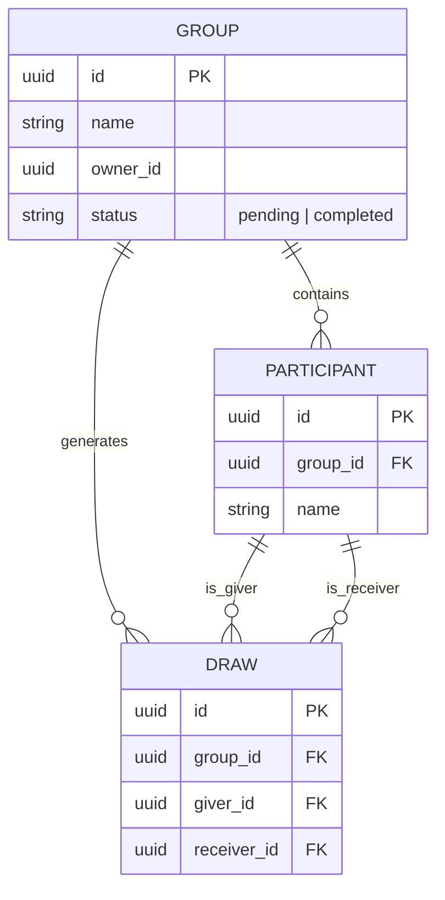

# 🛠️ Software Design Document (SDD)

**Projeto:** Quenhé - Amigo Secreto
**Versão:** 1.0.0  
**Status:** 🟡 Em desenvolvimento (MVP).

## 🤖 1. Orquestração e Contexto de IA (MCP)

> Configuração dos servidores Model Context Protocol para a IDE Agêntica.

- **Supabase MCP:** Contexto do banco de dados real e políticas de RLS.
- **GitHub MCP:** Leitura das Issues do Kanban para orientar a implementação.

## 📦 2. Stack Tecnológica e Bibliotecas

- **Core:** Angular 21+ (Standalone / Signals).
- **BaaS & Auth:** Supabase-js.
- **Estilização & UI:** Tailwind CSS v4, DaisyUI v5.

## 🎨 3. Design Tokens (Tailwind CSS + DaisyUI)

Definição das cores e tipografia principais utilizadas no protótipo de alta fidelidade. Os tokens são aplicados via tema customizado `quenhe` em `apps/web/src/styles.css`.

- **Cores Principais:**
  - `primary` (Vermelho - Botões e Destaques): `#E02424`
  - `secondary` (Verde - Ações de Sucesso/Entrar): `#059669`
  - `base-200` (Fundo do App): equivalente a `#F9FAFB`
  - `base-content` (Textos principais): equivalente a `#111827`
- **Tipografia:**
  - Família de Fonte: `Inter`, sans-serif
- **Bordas:**
  - `--radius-box: 1.5rem` e `--radius-field: 0.75rem` para cantos arredondados do Quenhé

### 3.1. Uso de componentes DaisyUI

Componentes são aplicados diretamente no HTML com classes semânticas, sem biblioteca Angular de UI:

| Elemento       | Classes de exemplo                    |
| :------------- | :------------------------------------ |
| Botão primário | `btn btn-primary`                     |
| Campo de texto | `input input-bordered`                |
| Card           | `card bg-base-100`                    |
| Link           | `link link-secondary`                 |
| Formulário     | `form-control`, `label`, `label-text` |

Documentação oficial: [daisyui.com/components](https://daisyui.com/components/)

## 🗄️ 4. Arquitetura de Dados

### 📖 4.1. Glossário Técnico (Mapeamento)

| Termo PRD (PT-BR) | Entidade Técnica (EN) | Atributos Principais                        |
| :---------------- | :-------------------- | :------------------------------------------ |
| Grupo             | `group`               | `id`, `name`, `owner_id`, `status`          |
| Participante      | `participant`         | `id`, `group_id`, `name`                    |
| Sorteio           | `draw`                | `id`, `group_id`, `giver_id`, `receiver_id` |

### 📊 4.2. Diagrama ER (Mermaid)

## 📂 5. Estrutura de Diretórios (Monorepo)

### 5.1. Scaffolding Base

O projeto utiliza a arquitetura de Monorepo com NPM Workspaces para manter o contexto unificado.

- `apps/` - Diretório raiz dos subprojetos.
  - `apps/api/` - Reservado para futuro backend/serviços isolados.
  - `apps/web/` - Aplicação Frontend principal (Angular).
- `docs/` - Documentação de requisitos e arquitetura.

### 5.2. Frontend (`apps/web`)

- `src/app/core/` - Interceptors, guards e serviços globais.
- `src/app/shared/` - Componentes reutilizáveis e pipes globais.
- `src/app/features/` - Módulos de negócio (login, grupos, sorteio).
- `src/styles.css` - Tailwind v4, plugin DaisyUI e tema `quenhe`.

## 🎨 6. Escolha do Sistema de Interface

**Opção Escolhida:** DaisyUI v5 (plugin Tailwind CSS).

**Justificativa:** Optamos pelo DaisyUI por integrar nativamente com Tailwind CSS v4, oferecer componentes prontos via classes utilitárias e reduzir a complexidade de setup em relação a bibliotecas baseadas em código copiado (copy-paste). O tema customizado `quenhe` preserva a identidade visual do produto (vermelho e verde) e permite evolução rápida da interface sem geradores CLI adicionais.

**Configuração:**

- Plugin em `apps/web/src/styles.css`: `@plugin "daisyui"`.
- Tema ativo em `apps/web/src/index.html`: `data-theme="quenhe"`.
